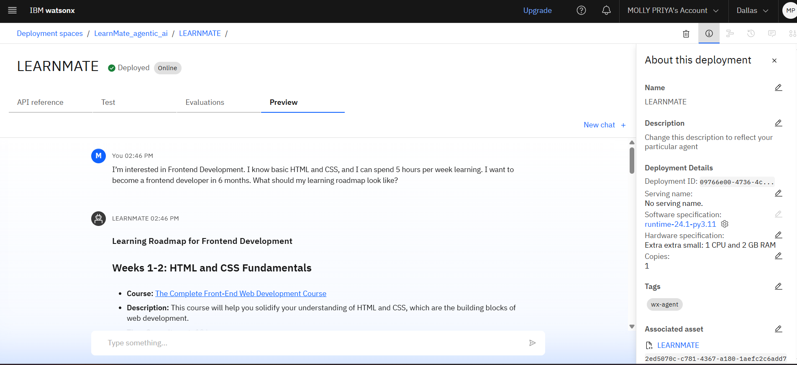
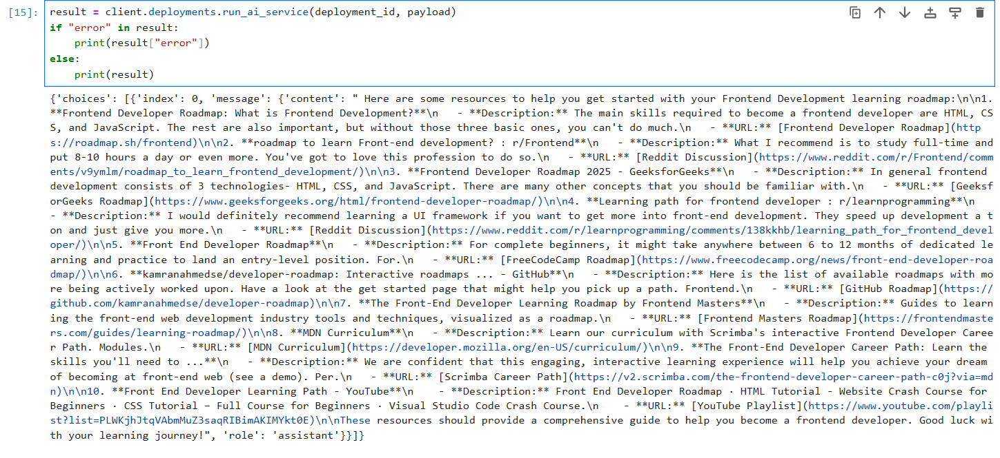

# EDUNET-FOUNDATION-IBM-SKILLSBUILD-4WEEKS-INTERNSHIP-ON-AI-IBM-CLOUD-TECHNOLOGIES
# LearnMate: Agentic AI for Personalized Course Pathways 🎓🤖

## 👤 Author

**Name**: Molly Priya  
**Email**: molly.priya.ug22@nsut.ac.in 
**College**: Netaji Subhas University of Technology (NSUT), Delhi – B.Tech in Computer Science and Engineering (AI)

## 🚀 Project Overview

LearnMate is an **Agentic AI Coach** designed to help students discover personalized learning paths based on their interests, skill levels, and goals. It dynamically interacts with users to assess their preferences and provides a tailored course roadmap that evolves over time.

## 🧠 Problem Statement

Students often struggle to identify the right learning path that aligns with their interests and long-term career goals due to the overwhelming number of online courses and a lack of personalized guidance. **LearnMate** addresses this challenge by offering intelligent and adaptive course recommendations through meaningful interactions.

## 🧩 Features

- 🔍 Understands user interests (e.g., Frontend Dev, Cybersecurity, UI/UX)
- 📊 Assesses current skill level and learning goals
- 🗺️ Generates dynamic and personalized course roadmaps
- 🔄 Continuously adapts based on user progress and feedback
- 🌐 Provides curated resources and project suggestions

## 🧠 Technologies Used

- **IBM SkillsBuild**  
  - *Getting Started with AI*
  - *Journey to Cloud*

- **LangChain + Retrieval Augmented Generation (RAG)**  
  - Context-aware response generation from external data

- **Edunet Foundation Sessions**  
  - Guidance on AI, Cloud, and agentic systems

- **Tools & Stack**  
  - LangChain, Mistral Models, IBM Cloud, ReAct, Langraph

## 🗂️ How It Works

1. The agent interacts with the user to collect preferences:
   - Interests, goals, skill level, time availability
2. A learning roadmap is created using predefined logic + external resource APIs
3. User progress and feedback are used to adjust the roadmap over time

## 📌 Sample Query

> "I’m interested in Frontend Development. I know basic HTML and CSS, and I can spend 5 hours per week learning. I want to become a frontend developer in 6 months. What should my learning roadmap look like?"

---

## 🌐 IBM Cloud Deployment Preview

---

## 🖥️ Local Deployment Preview

## 📈 Future Scope

- 📱 Mobile app version for anytime learning
- 🧑‍🎓 Integration with LinkedIn to sync course completion and skills
- 📚 Auto-curation of MOOCs from platforms like Coursera, Udemy, edX
- 🧪 Progress tracking dashboard and micro-certifications

